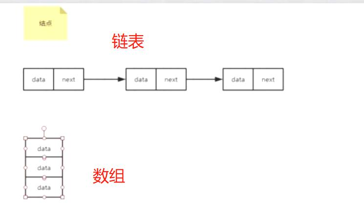
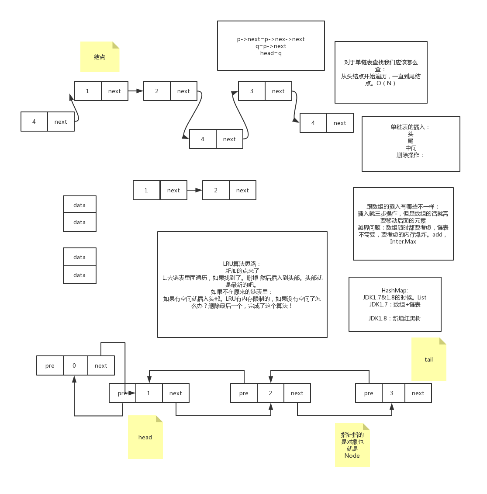
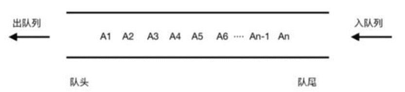
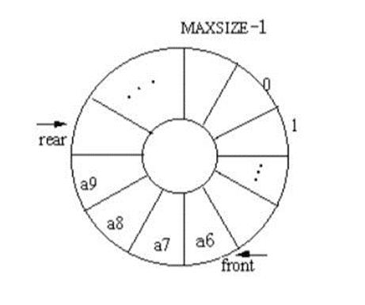

数据结构:
- 线性表结构   ： 数组、链表、堆、栈
- 非线性表结构 ： 树、图论

# 数组

## 经典题目
给你一个文件里面包含全国人民（14亿）的年龄数据（0~180），现在要你统计每一个年龄有多少人？
给定机器为 单台+2CPU+2G内存。不得使用现成的容器，比如map等。 // 不需要分布式和大数据。
数组算法，桶排序。
在以上情况下你该如何以最高效的方法来解决这个问题？
排序算法：1 1 1 2 2 2  3 3 3 4 4 5。想过没？能不能解决这个问题？：不能 为什么？
排序的最高效算法：O(nlogn) 14亿，排不出来，而且内存也不够。
int a[] = new int[180];a[0]++;0表示的是0岁，a[0]的值表示的就是0有多少人.
12：56
23：56111
52：9999888

## 数组的定义
1. 所谓数组，是有序的元素序列。 若将有限个类型相同的变量的集合命名，那么这个名称为数组名。组成数组的各个变量称为数组的分量，也称为数组的元素，有时也称为下标变量。用于区分数组的各个元素的数字编号称为下标。数组是在程序设计中，为了处理方便， 把具有相同类型的若干元素按无序的形式组织起来的一种形式。这些无序排列的同类数据元素的集合称为数组。int 的数组你就不能存float 也不能存double
数组是用于储存多个相同类型数据的集合。通常用Array表示，也称之为线性表，画图演示
2. 特点
(1)数组是相同数据类型的元素的集合。
(2)数组中的各元素的存储是有先后顺序的，它们在内存中按照这个先后顺序连续存放在一起。内存地址
(3)数组元素用整个数组的名字和它自己在数组中的顺序位置来表示。例如，a[0]表示名字为a的数组中的第一个元素，a[1]代表数组a的第二个元素，以此类推。

3. 表现形式
（1）一维数组
	Int a[],String a[]
（2）多维数组
	Int a[][],int a[][][]。 int a[m][n]:内存空间是多少？不管怎么样都是 m*n的空间大小； a[0][10]: 可以用链表解决，a[0]:->10>2   a[1]->15
4. 随机访问：
数组是连续的内存空间和相同类型的数据。
优点: 正是因为这两个限制，它才有了一个非常重要的特性：随机访问。
缺点: 但有利就有弊，这两个限制也让数组的很多操作变得非常低效，比如要想在数组中删除、插入一个数据，为了保证连续性，就需要做大量的数据搬移工作。
随机访问的重要应用：查找，面试重点

5. 数组的缺点：插入和删除
实现代码：
设数组的长度为n，现在，如果我们需要将一个数据插入到数组中的第k个位置。删除第N个位置的数据.

6. 使用数组一定要注意访问越界问题
数组最需要注意的就是越界：所以一定要多加判断，尤其是在开始和结束。测试的时候也一样注意头和尾。

7. 为什么很多计算机编程语言中数组的下标要从0开始呢？
定义一个数组一定会分配内存空间。数组的特点是 内存是一段连续的地址。
int a[] = new int[3];
到内存中申请空间：10001,10002,10003
存数据
 a[0] => 10001  ====> 10001+0*typesize
	a[1] =>  10002 =====> 10001+1*typesize
	a[2]=>   10003 =====> 10001+2*typesize
如果我们不从0开始 。  （这样就会多一步 -1 的计算啦）。
a[1] = 10001+(1-1)
a[2] = 10001+(2-1)
a[3] = 10001+(3-1)

8. 二维数组的内存地址是怎么样的？写出寻址公式？
a[] = new int[10]; ==> loc = init_loc(初始内存地址)+index(数组的下标)*size(数据的长度)

a[i][j] 
二维=>转化一维
1 2 3
4 5 6     => 1 2 3 4 5 6 => 4的下标在二维里面是 （1 ，0） =>在一维里面是第3个。=> i*n(一维的长度)+j（在列 ）=>1*3+0=3

a[i][j]: (i<n,j<m)
loc=init_loc+(i*n+j)*size

9. 总结: 
数组是一个最基础最简单的数据结构，必须要完全搞懂。它是存储相同类型的一组数据。
最大的两个特点就是下标和随机访问。
缺点就是插入和删除是很慢的，时间复杂度为O（n）。

下标：数组最优一个特点。这里可以通过下标表示成有意义的数据，不只是数据里面的标记，年龄和下标对应。
随机访问：可以直接通过下标定位到数组中的某一个数据 。  O(1) 复杂度。

## ArrayList和数组：
### 异同: 
本质是一样的，都是数组。ArrayList是JDK封装了。不需要管扩容等操作
数组的话就要你全部操作。

### 两者之间应该如何选用？：
不知道数据大小的肯定选ArrayList。
如果你知道数据的大小而且你又非常关注性能那就用数组。

## Java里面的内存分为几种？

Java分为堆栈两种内存。
什么是堆内存？：存放new创建的对象和数组
什么是栈内存？引用变量
堆栈都用Java用来存放数据的地方，与C++ /  c不一样。java自动管理我们的堆栈。gc，new出来的你没管过。

堆栈的区别：
1.栈的速度要快
2.栈内存的数据可以共享，主要存一些基本数据类型。 (字面量是共享的。)
int a = 3;	//在栈中创建变量a 然后给a赋值，先不会创建一个3而是先在栈中找有没有3，如果有直接指向。如果没有就加一个3进来。
int b =3;  //首先也要创建一个变量b，

1.面试经典：
String str1 = "abc"; String str2 = "abc"; System.out.println(str1==str2);	//true

String str1 = "abc"; String str2 = "abc"; str1 = "bcd"; 
System.out.println(str1 + "," + str2); 	//bcd,abc
// 栈内存的引用不会影响其他的引用。
System.out.println(str1==str2); 		//false 虽然最开始 str1和str2都指向同一个变量abc但str1引用变化后不会改变str2的
								
String str1 = "abc"; 
String str2 = "abc"; 
str1 = "bcd"; 
String str3 = str1; 
System.out.println(str3);  //bcd
String str4 = "bcd"; 
System.out.println(str1 == str4);	//true

String str1 = new String("abc"); 
String str2 = "abc"; 
System.out.println(str1==str2); 	//false  new在堆内存中新开了一个对象

String s1 = "ja";
String s2 = "va";
String s3 = "java";
String s4 = s1 + s2; //java 注意这个+号，java里面重载了+，其实调用了stringBuild，会new对象。
System.out.println(s3 == s4);	//false
System.out.println(s3.equals(s4));	//true 只是比较值

# 链表
## 面试经典：
1.如何设计一个LRU（最近最少使用）缓存淘汰算法？基础
最近使用，只需要维护一个有序的单链表就可以了。有序的指的就是加入的时间排序。越靠近链表尾部的结点是越早之前访问的。当有一个新的数据被访问时，我们从链表头开始顺序遍历链表。
> 如果此数据之前已经被缓存在链表中了，我们遍历得到这个数据对应的结点，并将其从原来的位置删除，然后再插入到链表的头部。
> 如果此数据没有在缓存链表中，又可以分为两种情况： 如果此时缓存未满，则将此结点直接插入到链表的头部；  如果此时缓存已满，则链表尾结点删除，将新的数据结点插入链表的头部。

2.约瑟夫问题：详细描述我会写在这里。
课后完成。
约瑟夫问题是个有名的问题：N个人围成一圈，从第一个开始报数，第M个将被杀掉，最后剩下一个，其余人都将被杀掉。例如N=6，M=5，被杀掉的顺序是：5，4，6，2，3，1。
**现在问你最后留下的人是谁？**
比如N=6，M=5
留下的就是1
1 2 3 4 5 6 => 6 1 2 3 4 => 6 1 2 3 =>1 2 3 => 1 3 => 1
> 建循环链表。last.next = head;
> for(int i = 0 ; i < m - 1; i++){cur = cur.next} => cur.next ==> cur 结束, int n,n==1结束;
> 2种情况都可以判断为结束条件： size 和 head = cur.

## 链表简介
1.链表的定义

链表通过指针将一组零散的内存块串联在一起。其中，我们把内存块称为链表的“结点”(数据)。为了将所有的结点串起来，每个链表的结点除了存储数据之外，还需要记录链上的下一个结点的地址。画图演示：

2.特点
(1)不需要连续的内存空间。
(2)有指针引用
(3)三种最常见的链表结构：单链表、双向链表和循环链表

## 单链表

图形：

从单链表图中，可以发现，有两个结点是比较特殊的，它们分别是第一个结点和最后一个结点。我们一般把第一个结点叫作头结点，把最后一个结点叫作尾结点。
其中，头结点用来记录链表的基地址。有了它，我们就可以遍历得到整条链表。而尾结点特殊的地方是：指针不是指向下一个结点，而是指向一个空地址NULL，表示这是链表上最后一个结点。while(p.next != null){} head 自己记录的

插入/删除 方式: 
- 头插法：
- 尾插法：
- 中间插法：

链表的查找、插入和删除.List => 
LinkedList 
AarryList 

## 循环链表
循环链表是一种特殊的单链表。实际上，循环链表也很简单。
它跟单链表唯一的区别就在尾结点。我们知道，单链表的尾结点指针指向空地址，表示这就是最后的结点了。
而循环链表的尾结点指针是指向链表的头结点。
你应该可以看出来，它像一个环一样首尾相连，所以叫作“循环”链表。

## 双向链表
单向链表只有一个方向，结点只有一个后继指针next指向后面的结点。
双向链表，顾名思义，它支持两个方向，每个结点不止有一个后继指针next指向后面的结点，还有一个前驱指针prev指向前面的结点。
双向链表需要额外的两个空间来存储后继结点和前驱结点的地址。所以，如果存储同样多的数据，双向链表要比单链表占用更多的内存空间。
虽然两个指针比较浪费存储空间，但可以支持双向遍历，这样也带来了双向链表操作的灵活性。
那相比单链表，双向链表适合解决哪种问题呢？

B+Tree:Mysql索引 叶子节点 双向链表

## 数组VS链表
|  时间复杂度   | 数组  | 链表 |
|  ----  | ----  | ----  | 
| 插入、删除  | O(n) | O(1) | 
| 查询   |  O(1) |O(n) | 

稀疏数组：一般是针对多维数组。
1 2 -1 -1
4 -1 6 -1
9 -1 1 -1
a[3][4]; 3*4=12空间。
稀疏数组就是真正存的数据远远小于我们开的空间。
这种情况 往往会用链表来代替。

重要区别：
1. 数组简单易用，在实现上使用的是连续的内存空间，可以借助CPU的缓存机制，预读数组中的数据，所以访问效率更高。
2. 链表在内存中并不是连续存储，所以对CPU缓存不友好，没办法有效预读。
3. 数组的缺点是大小固定，一经声明就要占用整块连续内存空间。如果声明的数组过大，系统可能没有足够的连续内存空间分配给它，导致“内存不足（out ofmemory）”。如果声明的数组过小，则可能出现不够用的情况。
4. 动态扩容：数组需再申请一个更大的内存空间，把原数组拷贝进去，非常费时。链表本身没有大小的限制，天然地支持动态扩容。
5. 链表容易出现栈溢出。

## 总结

# 栈
## 思考
面试经典：
1.如何设计一个括号匹配的功能？比如给你一串括号让你判断是否符合我们的括号原则，如下所示：
[(){()}{}]符合{}[]{[][[]
[][]{
{}[}}{}}]]] 不符合
栈

2.如何设计一个浏览器的前进和后退功能？
两个栈
浏览器，点后退出站到另一个入站。点前进从另一个出站到入站
点新页面，一个栈清空，另一个入栈。

## 简介

1.如何理解栈
比如我们在放盘子的时候都是从下往上一个个放，拿的时候是从上往下一个个的那，不能从中间抽，这种其实就是一个典型的栈型数据结构。
后进先出即Last In First Out （LIFO）。

2.栈如何实现
其实它是一个限定仅在表尾进行插入和删除操作的线性表（数组和链表）。栈其实就是一个特殊的链表或者数组。

3.术语
这一端被称为栈顶，相对地，把另一端称为栈底。
向一个栈插入新元素又称作进栈、入栈或压栈，它是把新元素放到栈顶元素的上面，使之成为新的栈顶元素；
从一个栈删除元素又称作出栈或退栈，它是把栈顶元素删除掉，使其相邻的元素成为新的栈顶元素。

4.疑问
既然栈也是一个线性表，那么我们肯定会想到数组和链表，而且栈还有这么多限制，那为什么我们还要使用这个数据结构呢？
不如直接使用数组和链表来的更直接么？
数组和链表暴露太多的接口，实现上更灵活了，有些技术理解不到位的人员就可能出错。
所以在某些特定场景下最好是选择栈这个数据结构。

5.栈的分类
（1）基于数组的栈
以数组为底层数据结构时，通常以数组头为栈底，数组头到数组尾为栈顶的生长方向
// 尾删和尾插.

（2）基于单链表的栈
以链表为底层的数据结构时，以链表头为栈顶，便于节点的插入与删除，压栈产生的新节点将一直出现在链表的头部
// 头插和头删

最大的区别就是扩容，链表天然支持动态扩容。栈溢出。

6.栈的基本操作：
假定以数组来实现
(1)入栈
(2)出栈
(3)时间复杂度分析 :  出栈入栈都是O(1)的操作。 比较高效的数据结构。

## 栈的应用
匹配、后进先出，2大特性。
### 括号匹配
[{]] => {}[]<>()
[
[{
[{} => {}
[]
栈来实现：
左括号：[{=>[
右括号来了：},}我们就是找栈顶看是不是和右括号匹配，匹配的话就出栈,最后判断栈是否为空。

### 代码函数调用中的应用
main{
add();
}

add(){
sub();
}
是不是这个sub最先完成。sub又是最后才进来的吧 是不是就是后进先出，函数调用就是用的栈来实现的。

### 数学表达式求值：
比如用栈实现一个简单的四则运算：3+11*2+8-15/5，用栈来实现这个算术表达式
两个栈来实现：一个放数字 一个放符号。

我们从头开始遍历这个算术表达式：
1.遇到是数字 我们就直接入栈到数字栈里面去。
2.遇到是符合 就把符号栈的栈顶拿出来做比较。
如果说他比栈顶符号的优先级高就直接入栈，如果比符号栈顶的优先级低或者相同，就从符号栈里面取栈顶进行计算（从数字栈中取栈顶的2个数），计算完的结果还要再放入到数字栈中。
3.最后清空2个栈的内容。

进阶: 如果是带括号的需要先做括号匹配，再按照上面的操作。

# 队列
## 思考
### CPU：
线程池里面当任务满时，此时又来一个新任务，线程池是如何处理的？具体有哪些策略？这些策略又是如何实现的呢？
有几种处理策略：
1.排队：阻塞队列。有空闲的时候再拿，不就是那个take和put，如果是在公平的情况下，那肯定就是先进先出。这就是今天讲的队列。这时候我们就有两种方式，一个是无限的排队队列。（链表，千万别用。LinkedBlockingQueue，JDK的），还有一种就是有界（用数组来实现的），只处理我们开的空间大小，多了的继续抛出去。Integer.MAX=?2^32-1=21亿多，但是注意的是这个队列大小，别搞小了。就不够，大了就浪费。在一些小型系统，你知道数据请求量是不大的，可以用。
2.丢弃：不处理了，直接抛出去。

## 什么是队列？
1.队列的定义：
定义：队列是一种特殊的线性表，特殊之处在于它只允许在表的前端（front）进行删除操作，而在表的后端（rear）进行插入操作，和栈一样，队列是一种操作受限制的线性表。
进行插入操作的端称为队尾，进行删除操作的端称为队头。队列中没有元素时，称为空队列。
队列的数据元素又称为队列元素。在队列中插入一个队列元素称为入队，从队列中删除一个队列元素称为出队。因为队列只允许在一端插入，在另一端删除，所以只有最早进入队列的元素才能最先从队列中删除，故队列又称为先进先出（FIFO—first in first out）线性表，LIFO。树
队列这个概念非常好理解。你可以把它想成排队买票，先来的先买，后来的人只能站末尾，不允许插队。先进者先出，这就是典型的“队列”。
栈：后进先出。

2.队列的特点
（1）线性表：链表或者数组
（2）FIFO

 
3.队列的分类

操作分类： 
- 单向队列（Queue）：只能在一段插入数据，另一端删除数据。
- 双向队列（Deque）：每一段都可以进行插入数据和删除数据的操作。

实现分类: 
1. 顺序队列的实现,是基于数组实现的

2. 链式队列的实现。
3. 循环队列,是一种顺序存储结构表示的队列，为了解决假溢出问题而将他设置成头尾相接的循环队列。

4.队列的基本操作：
我们知道，栈只支持两个基本操作：入栈push()和出栈pop()。
队列跟栈非常相似，支持的操作也很有限，最基本的操作也是两个：
入队enqueue()，放一个数据到队列尾部；
出队dequeue()，从队列头部取一个元素。

所以，队列跟栈一样，也是一种操作受限的线性表数据结构。作为一种非常基础的数据结构，
队列的应用也非常广泛，特别是一些具有某些额外特性的队列，
比如循环队列、阻塞队列、并发队列。
它们在很多偏底层系统、框架、中间件的开发中，起着关键性的作用。

5.队列的实现方式：
顺序队列&链式:
链表就是可以无限扩容:内存 size大小控制。add 缓存；LRU

实战：使用数组实现一个队列

6.循环队列：
重点： 数据结构为 少用一个存储位置。

怎么判断队列已经满了？
head=tail-1 ？
tail=n ？ 
都不是，有下面两种方法：
加了一个实际的size变量就可以了。
画一个循环队列满了的图。
判断满：(tail+1)%n==head

怎么判断空？tail==head

数组实现和单向链表的区别: 
总结可以看出：
1. 数据结构上： 单向和循环主要的区别就是  ： 少用一个存储位置 =》 最大的长度比数组长度-1。
2. 操作head和tail就是，环用取余的方式。
3. 判断大小和判断是否是满的 ， 也是用 取余的操作，因为有一些特殊性质。
4. 其他的操作，如扩容、缩容，移动，push、pop，判断为空 都是相同的操作。

## 应用
7.优先队列：
回到排队的场景，有些vip客户，总是可以插队。抽奖的时候，
普通用户，vip用户，svip用户。
优先队列：其实也没你们想的那么难，其实就是在插入的时候排了序而已
优先级队列，在插入中加入排序。

8.阻塞队列：此种具有特殊特性的队列应用却比较广泛，比如阻塞队列和并发队列。阻塞队列其实就是在队列基础上增加了阻塞操作。简单来说，就是在队列为空的时候，从队头取数据会被阻塞。因为此时还没有数据可取，直到队列中有了数据才能返回；如果队列已经满了，那么插入数据的操作就会被阻塞，直到队列中有空闲位置后再插入数据，然后再返回。
阻塞队列，在push和pop里面加入阻塞就行了。

9.队列在线程池中的应用

课后作业：
用链表实现来一个单向队列和双向队列。

# 参考资料
- [几种回文算法的比较](https://www.cnblogs.com/zjsxdmif/p/10113435.html)
> 判断括号匹配，不合适。因为中途还有其他的字符。 
- [十字链表](baike.baidu.com/item/十字链表/9679168?fr=aladdin)
- [循环队列：判断队列空和满的3种方法](https://blog.csdn.net/lilililililiki/article/details/104317286)
> 三种方案： 少用一个存储位置；设置一个标记位；计数count。 图解队空和队慢的状态。 
> 队满取余讲解详细
- [数组的循环队列中判断队满与队空](https://blog.csdn.net/u010429311/article/details/51043149)
> 为了达到判断队列状态的目的，可以通过牺牲一个存储空间来实现。 最大大小为cap - 1;
> 有size的计算公式：   (tail - head + cap) % cap; 队空，队满如上。
- [数据结构----队列，双向队列（Deque），循环队列](https://blog.csdn.net/weixin_39453361/article/details/108864526)

