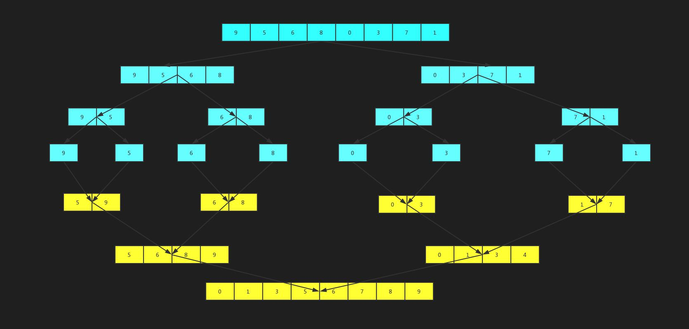

# 分类
插入&希尔&归并排序：递进
选择&冒泡&快速：递进
堆排序：树论高级篇里面。

# 分析
1. 时间效率：决定了算法运行多久，O（1）
2. 空间复杂度：
3. 比较次数&交换次数:排序肯定会牵涉到两个操作，一个比较是肯定的。交换。
4. 稳定性：这是什么？ 
稳定排序有什么意义？应用在哪里呢？
排序算法如果是稳定的，那么从一个键上排序，然后再从另一个键上排序，第一个键排序的结果可以为第二个键排序所用。
比如： 
电商里面订单排序：首先会按金额从小到大排，金额相同的按下单时间。我从订单中心过来的时候已经按照时间排好序了。
1  8:01   65
2  20:05  30
3  21:10  30
4  22:01 45  
我选择排序算法：如果我选择不稳定的排序算法 那我还要比较两次的，如果我选择稳定的排序算法 那我就只要比较一个字段。

# 插入排序
假设有个这样的问题：打扑克。分成两部分：一部分是你手里的牌（已经排好序），一部分是要拿的牌（无序）。把一个无序的数列一个个插入到有序数列中。
一个有序的数组，我们往里面添加一个新的数据后，如何继续保持数据有序呢？我们只要遍历数组，找到数据应该插入的位置将其插入即可。

## 具体步骤
以上这种往一个有序的集合里面插入元素，插入后序列仍然有序这就是插入排序算法思路。理解起来不难吧。那么插入排序具体是怎么实现呢？
具体步骤如下：
1.将数组分成已排序段和未排序段。初始化时已排序端只有一个元素
2.到未排序段取元素插入到已排序段，并保证插入后仍然有序
3.重复执行上述操作，直到未排序段元素全部加完。
有几种数据结构，用什么数据结构来实现。数组，链表，2个数组。


看以下这个例子：对7 8 9 0 4 3进行插入排序
7 8 9 0 4 3
7 8 9 0 4 3
7 8 9 0 4 3
0 7 8 9 4 3
0 4 7 8 9 3
0 3 4 7 8 9
从以上操作中我们看到插入排序会经历一个元素的比较以及元素的移动。
当我们从待排序列中取一个数插入到已排序区间时，需要拿它与已排序区间的数依次进行比较，直到找到合适的位置，然后还要将插入点之后的元素进行往后移动。
那么用代码怎么实现呢？


## 插入排序分析

1.时间复杂度 : O(n^2) ~   O(n)
2.空间复杂度 : O(1)
3.稳定性：稳定
插入排序是稳定的吗？稳定
希尔排序呢？不稳定的
归并排序呢？稳定


## 总结
- 从尾到头，比从头到尾更快？为什么？
> 不能用break，还得从后往前移动。
> 从头到尾，插入相当于中间插入，其余没有遍历的还是要遍历移动一遍。  
> 尾插，再比较的时候就后移了，遇到合适的位置就break不再继续额外移动了，最好的情况是O(1)。   
> 尾插特殊情况可以到O(1)。 头插一定是O(n)

- 不管头插还是尾插，带=就不稳定的。
- 改成链表只是优化，移动的快慢。


插入排序的应用场景，稳定性高。
已按下单时间排好序的数据，再次价格排序的需求。
插入排序比冒泡排序用的还多。

# 希尔排序
希尔排序其实是插入排序的一个改进版。他是怎么改进呢？

希尔排序是先将整个待排序的记录序列分割成为若干子序列分别进行直接插入排序，待整个序列中的记录"基本有序"时，再对全体记录进行依次直接插入排序。


总结说就是： 
只是插入的升级版本，它是为了内层的排序尽可能执行break；
先在做步长的分组插入排序，使其基本有序。 最后步长为1后就是正宗的插入排序啦。
最好可以达到O(NlogN)的时间复杂度。 最坏还是O(n^2)
所以但是本质的时间复杂度还是一样。
比直接插入要快，但是不稳定，这个是重要特点。

代码实现就是再外面套了一层步长的循环（lgN的实现），之后以步长为前一个元素的比对。


# 归并排序
归并排序是一种非常高效的排序算法，其核心思想就用到了我们递归和分治的思想，那么具体是怎么样的呢？举例实现：
假设我们对以下序列排序：
9 5 6 8 0 3 7 1



归并排序分析：
主要分析时间复杂度：nlogn
其他的就和插入排序是一样的


归并采用分治（高效排序，JDK排序源码实现，需要看一下。），里面还是用了基础的插入排序思想（向有序的里面插入）。
归并3个while只有2个执行。

# 选择排序
项目中几乎不用。 但需要知道。
## 工作原理
是每一趟从待排序的数据元素中选出最小（或最大）的一个元素，顺序放在已排好序的数列的最后，直到全部待排序的数据元素排完。
## 流程
（1）首先从原始数组中选择最小的1个数据，将其和位于第1个位置的数据交换。
（2）接着从剩下的n-1个数据中选择次小的1个元素，将其和第2个位置的数据交换
（3）然后，这样不断重复，直到最后两个数据完成交换。最后，便完成了对原始数组的从小到大的排序。

具体过程和实现如图： 

代码： 定义3个指针，min、排序的尾下标i、待排序的头下标j。  i!=min就交换

## 和插入排序的异同
选择排序的思路和插入排序非常相似，也分已排序和未排序区间。
但选择排序每次会从未排序区间中找到最小的元素，将其放到已排序区间的末尾。
但是不像插入排序会移动数组 选择排序会每次进行交换。
## 选择排序分析
1. 时间复杂度：O(N^2)
2. 空间复杂度:O(n)
3. 交换次数
4. 稳定性:不稳定（交换一定是不稳定的。）


# 冒泡排序
## 核心思路
相邻的2个比较，先确定最大的（最大的第二大的....），冒泡放到最后面。
冒泡排序只会操作相邻的两个数据。
每次冒泡操作都会对相邻的两个元素进行比较，看是否满足大小关系要求。如果不满足就让它俩互换。
一次冒泡会让至少一个元素移动到它应该在的位置，重复n次，就完成了n个数据的排序工作。
## 流程和例子
举例说明：4 5 6 3 2 1,从小到大排序。
1 2 3 4 5 6进行排序：什么样的情况下不做任何交换了呢，那就是所有的数都在它应该在的位置；O(n)

第一次冒泡的结果:4 5 6 3 2 1->4 5 3 6 2 1 - > 4 5 3 2 6 1 -> 4 5 3 2 1 6,哪个元素的位置确定了，6
第二次冒泡的结果:4 5 3 2 1 6->4 3 5 2 1 6 -> 4 3 2 5 1 6 -> 4 3 2 1 5 6,哪个元素的位置确定了，5,6
第三次冒泡的结果:4 3 2 1 5 6->3 4 2 1 5 6 -> 3 2 4 1 5 6 -> 3 2 1 4 5 6,哪个元素的位置确定了，4,5,6
第四次冒泡的结果:3 2 1 4 5 6->2 3 1 4 5 6 -> 2 1 3 4 5 6,哪个元素的位置确定了，3,4,5,6
第五次冒泡的结果:2 1 3 4 5 6->1 2 3 4 5 6  哪个元素的位置确定了，1,2,3,4,5,6
## 实现
第一个for为什么n-1。最后一个不需要排序。
2层for，一次比较。 data[j] > data[j + 1]

## 冒泡排序分析
1.时间复杂度:O(n^2)
2.空间复杂度:O(n)
3.交换次数:挺大的,最坏是n! 
4.稳定性:稳定。 （有等号，就是不稳定。  没有等号就是稳定。）

## 优化
1. 优化外层循环: 加个标识，没有交换就不再排序啦。
2. 优化内层循环: 记住最后一次交换发生位置,以区分有序和无序区，将直接到无序区中去交换。

# 快速排序
## 核心思路
快速排序应该算是在冒泡排序基础上的递归分治法。
选基数，小于基准数放到左边，大于基准数的放到右边，直到各个分区都是1为止。


## 具体过程和举例。
45 28 80 90 50 16 100 10
基准数：一般就是取要排序序列的第一个。
第一次排序基准数：45
从后面往前找到比基准数小的数进行对换：
10 28 80 90 50 16 100 45
从前面往后面找比基准数大的进行对换：
10 28 45 90 50 16 100 80
   
10 28 16 90 50 45 100 80

10 28 16 45 50 90 100 80
以基准数分为3部分，左边的比之小，右边比之大：
{10 28 16} 45 {50 90 100 80}
到此第一次以45位基准数的排序完成。 
这时，左右两个分区的元素就相对有序了
## 代码核心
2个指针加一个基数，分左右段递归。

if(ll < rr)  可以有效的避免再申请一个变量flag;  
因为如果找到了，就肯定是ll<rr。 巧妙的避免了一个变量。

## 快速排序分析
1. 时间复杂度:nlogn 最坏的情况就是O(n^2)
2. 空间复杂度:O(n)
3. 稳定性：不稳定
## 快排和归并的对比：
（1）归并排序的处理过程是由下到上的，先处理子问题，然后再合并。
（2）快排其实就是从上到下，先分区，在处理子问题，不用合并。类似于尾递归。

## 优化
其优化就是优化基准数,提供一个取三个数中间的思路.
优化1：序列长度达到一定大小时，使用插入排序: 基本有序用插入就更快了。
优化2：尾递归优化： 
优化3：聚集元素： 在一次分割结束后，将与本次基准相等的元素聚集在一起，再分割时，不再对聚集过的元素进行分割。
优化4：多线程处理快排： 分治法都可以用多线程

# 桶排序
## 原理
将需要排序的数据分到几个有序的桶里，每个桶里的数据再单独进行排序（一般这些是相同的才能达到O(N)），排序完成，再将每个桶的数据都取出来，组成新的有序的数据。
## 应用
- 21亿全国人口普查。   arr[avg] = arr[avg]++;
- [字母排序变成O(n)的效率](https://www.cnblogs.com/studyDetail/p/7228388.html)
> 52个桶，计出现的个数。 最后再遍历就行了。 aabbbccc的样子了。
- [如何把百万级别的订单根据金额排序](https://blog.csdn.net/qq_14855971/article/details/106913476)
> 内存一次性放不下。先按桶排序，分到不同的小文件里面。再最小文件里面的数据做快排。最后一些小文件组合起来就是完整的啦。
# 计数排序
## 原理
是桶排序的升级版。 也就是说做了额外的处理操作。 
每个桶内的数据都是相同的大小，也就不需要桶内排序，这是与桶排序最大的区别。

核心： 就是多一个步把统计数组做变形，后面的元素等于前面元素之和。（这就是排名了）

## 步骤
（1）找出待排序的数组中最大和最小的元素
（2）统计数组中每个值为i的元素出现的次数，存入数组C的第i项
（3）对所有的计数累加（从C中的第一个元素开始，每一项和前一项相加）
（4）反向填充目标数组：将每个元素i放在新数组的第C(i)项，每放一个元素就将C(i)减去1
## 应用
如何对一个省200万学生的高考成绩进行排序

# 基数排序
其原理是将整数按位数（先按个位,再按十位等等）切割成不同的数字，然后按每个位数分别比较。

# 基数排序 vs 计数排序 vs 桶排序
这三种排序算法都利用了桶的概念，但对桶的使用方法上有明显差异：

基数排序：根据键值的每位数字来分配桶；
计数排序：每个桶只存储单一键值；
桶排序：每个桶存储一定范围的数值；

# 各种排序对比


这么多种排序算法我们究竟应该怎么选择呢？:
1.分析场景：稳定还是不稳定
2.数据量：数据量小的时候选什么？比如就50个数，优先选插入（5000*5000=25000000） 【用插入和冒泡（没有递归的操作，虽然时间复杂度高，但是和递归比，可以忽略不计）】
3.分析空间：

综上所述，没有一个固定的排序算法，都是要根据情况分析的。
但是如果你不会分析的情况下 选择归并或者快排。【其实就是杀鸡用牛刀。 保证系统稳定。】

源码级别的使用： 
C++ qsort：快排+插入排序
jdk里面有arrays.sort:一种是基础类型，int double 用的快排。对象排序，用的是归并+timeSort


# 三种交换变量的方法
  交换变量的方式又哪几种？  减少申请变量空间，用于c等低级语言。
  > 第三者交换法应用场景最广泛，异或次之，再者是加法交换法，应当根据不同场景分别使用。
## tmp 
## 异或
- 只能用于交换可以进行异或运算的数据类型
- 如果 x , y 指向同一个内存地址，则异或交换法失效
```
x = x ^ y;
y = x ^ y;
x = x ^ y;
```
## 加减操作。
- 不能交换非数字类型的变量
- 对于浮点类型的变量可能会出现问题
- 加法过程中可能会出现超出上限的问题
```
//a = a + b => a = 3+2 =5;
//b = a - b => b = 5-3 =2;
//a = a - b => a = 5-2 =3;
```
# 参考资料
- [各种排序算法总结](https://blog.csdn.net/weixin_39828847/article/details/113365428)
> 选择排序算法的准则和依据：4点，大小、数量、结构分布、稳定性。

- [深入学习排序算法之稳定性、比较次数、交换次数探讨](https://blog.csdn.net/dreamer2020/article/details/8740244)
> 有比较次数、交换次数、稳定性的对比图。
- [排序 —— 希尔排序](https://blog.csdn.net/weixin_43715360/article/details/120140579)
> 详细的图解过程。 可以看看他。

- [十大经典排序算法](https://www.runoob.com/w3cnote/ten-sorting-algorithm.html)

- [选择排序定义和过程详解](https://blog.csdn.net/alzzw/article/details/97964320)
- [选择排序（图解）](https://blog.csdn.net/qq_33289077/article/details/90263964)
- [三种交换变量的方法](https://blog.csdn.net/Mine268/article/details/108956509)
- [冒泡排序算法及其两种优化](https://blog.csdn.net/yanxiaolx/article/details/51622286)
- [快速排序算法详解（原理、实现和时间复杂度）](http://data.biancheng.net/view/117.html)
> 核心思路有图的讲解
- [快速排序的4种优化](https://blog.csdn.net/qq_38289815/article/details/82718428)
- [数据结构与算法学习笔记之为用于高考名次排序的排序算法](https://cloud.tencent.com/developer/article/1368137)
> 4中排序，原理讲解的不错。 桶排序、计数排序、基数排序、字母排序
- [排序----计数](https://zhuanlan.zhihu.com/p/80268929)
> 如果把数组的内容由对应下标元素的个数换成出现在我之前的元素个数总和，是不是直接得到了我的排名？
- [百万考生分数如何排序 - 计数排序](https://cloud.tencent.com/developer/article/1661574)
> 知道计数排序的情况下，定义和图解的比较清晰。


