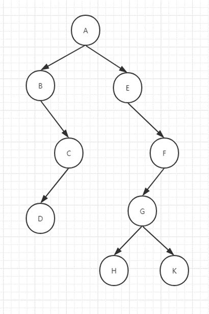

# 定义
- 如果树的结点个数为0，则树为空树
- 如果树的结点个数为1，则该结点是被称为根结点的结点
- 如果树的结点个数大于1，则必存在一个称为根的结点，它的分支下是几个互不相交的有限集合，并且这些互不相交的有限集合本身又是一棵树。
# 术语
1. 结点：树里面的元素。
2. 父子关系：结点之间相连的边(边指节点和节点的连线)
3. 子树：当结点大于1时，其余的结点分为的互不相交的集合称为子树。（以一个结点作为根结点的子数是唯一的）
4. 度：一个结点拥有的子树数量称为结点的度。（结点分支的个数）
5. 叶子结点 ：度为0的结点
6. 孩子（子节点）：结点的子树的根称为孩子结点
7. 双亲（父节点）：和孩子结点对应
8. 兄弟：同一个双亲结点
9. 森林：由N个互不相交的树构成深林

10. 树的度 ： 所有结点中最大的度
11. 分支结点： 度大于0的结点为分支结点，显然除了叶子结点之外的结点都为分支结点（包括根节点）。
12. 兄弟结点： 父节点下的所有子结点互为兄弟结点，同一个双亲结点。
13. 堂兄弟结点： 位于同一层的，并且父节点之间是兄弟结点的结点互为堂兄弟结点。
14. 路径：  从一个结点到另一个结点之间的边和结点构成路径

在树形结构里面有几个重要的术语：
15. 结点的高度：结点到叶子结点的最长路径
16. 结点的深度：根结点到该结点的边个数
17. 结点的层数：结点的深度加1
18. 树的高度：根结点的高度

# 树的种类

平衡二叉树
二叉查找树：
B树（B-Tree，B+Tree）：不是；N叉；
红黑树
完全二叉树：堆排序；大顶堆，小顶堆；
满二叉树

# 二叉树
在树形结构中最重要的就是二叉树，很多经典的算法与数据结构其实都是通过二叉树发展而来。

Binary Tree:一种特殊的树形结构，每个节点至多只有两颗子树。
在二叉树的第N层上至多有2^(N-1)个结点。总共最多有2^N-1个结点个数。
满二叉树：除叶子结点外，每个结点都有左右两个子结点。
完全二叉树：除最后一层外，其他的结点个数必须达到最大，并且最后一层结点都连续靠左排列。
完美二叉树: 完全被填充，也就是说有2^N-1个数。
通过定义可以看出，完全二叉树和完美二叉树都是满二叉树里面的一个子集
## 为什么要分 满二叉树和完全二叉树呢？

要想清楚上面那个问题我们要从树形结构的存储开始：

基于链表的链式结构：
{
data;
left;
right;
}

基于数组存储：利用数组下标。假设A为i，则B=2*i,C=2*i+1，依次类推
但是假如是下面第二图这种情况，用数组存储会发生什么情况？
 

你会发现如果用数组来存储的话会浪费很多空间，那怎么办呢？大家最先想到的肯定是链表，对的，
是要借用链表来实现，但是数组的性能是高效的，也不需要开额外的指针，所以如果是一棵完全
二叉树的话我们就可以用数组来实现，这也是为什么还要分一个完全二叉树出来的根本原因。
后面的堆还会在来看这个结构。

总结的说： 
完全二叉树用于堆数，基于数组存储的话，二叉树可能会浪费一个存储空间。 
而完全二叉树是从左开始的，表达式 2*i 和 2*i+1 完全可以实现且不会浪费空间。 
这也是为什么需要完全二叉树，单独的出来理解的。
完全二叉树和满2叉树，都可以用数组来实现。  数组遍历更快。cpu缓存。

# 四种遍历方式
## 定义
重要口诀：根节点输出！子树
碰到根节点就要输出，还有子树的概念。
他们的时间复杂度都是一样的。 O(2N) => O(N)

    
前序：根 左 右 ABCDEFGHK   
中序：左 根 右 BDCAEHGKF  
后序：左 右 根 DCBHKGFEA

层次：二叉树从上到下，从左到右依次打印每个节点中存储的数据。
ABECFDGHK
## 代码总结
二叉树的前序、中序、后序遍历需要用到栈（递归的过程也就是一个栈），层次遍历需要借助队列这个数据结构。
层次遍历使用到了广度优先搜索。技巧：深度优先用递归，广度优先用队列。

链表，先建立叶子节点。 可以减少很多的null判断和set.

作业用数组实现二叉树和层次遍历。

# 二叉搜索树 | 二叉查找树 | 二叉排序树
## 定义（特点）
1.如果它的左子树不为空，则左子树上结点的值都小于根结点。
2.如果它的右子树不为空，则右子树上结点的值都大于根结点。
3.子树同样也要遵循以上两点
> 为什么又叫做二叉排序树呢？ 二叉树的遍历方式：前 中 后 层次（Mysql）
> 只要一颗树是二叉搜索树，那么它的中序遍历一定是有序的。左根（输出）右
> 看右边的这颗二叉树，它的中序遍历为：左根右
> 左 根（输出） 右：0 3 4 5 6 8

## 应用
二叉查找算法：猜数字，0~100出一个数，让你猜。每次会告诉你猜的结果是大了还是小了。
50 大了-> 51~100
小了 0~50每次一猜就可以排除一半的空间. 归并排序，logn；有序的序列（前提）。

## 代码逻辑
增删改查都是从根开始操作的。 （插入和查找过程一样）。
- 查找： 
中序遍历是左根右就是有序的。
- 插入： 
插入的时候每次都是和根结点比较。一直要找到它应该插入的位置。
肯定会插在叶子结点（如果数字重复了，也是再叶子上存着）。插入其实就是查找。
相同也可以就覆盖...，看具体的问题。 如改成数组去存，或者覆盖。 类似于hashMap的情况。

- 删除一个点： 
比较难的一个点。这才是比较重点的。
删除就和后继节点做交换就行了。   

后继节点： 右边第一个比他大的数。（不是相邻的节点）  所以他的左子树一定为空。

二叉搜索的删除：必须会
分三种情况：
1.要删除的结点是叶子结点 O(1)
2.要删除的结点只有一个子树（左或者右）O(1)
3.要删除的结点有两颗子树：找后继结点，而且后继结点的左子树一定为空。

当做作业。  要调用查找的方法，
作业：实现二叉搜索树的删除
## 性能分析
查找 logn。 查找时间复杂度其实就是树的深度。
插入：nlogn 有n个数要插入，每一个都要先查找到它的位置 就是logn 合起来就是nlogn,插入单个肯定是logn
删除：logn

# 平衡二叉树
一直往一边插入就变成了链表。 时间复杂度退化成了O(N)
解决?  不要变成一个链条一样，插入的时候判断是否该平衡一下操作。
自平衡二叉查找树(AVL树)：平衡二叉树，它的左右子树高度之差不超过1，这样确实可以避免一条直线型的结构，但还不是我们最理想的， 因为平衡要求的太高了，可以认为是理想状态，实验室。
红黑树： 通过性能综合考虑选用，它才是我们项目中用的。
还有伸展树和替罪羊树。

# 红黑树
面试红黑树比较多。 具体操作不会问，最多问性质，怎么操作，再具体就是变颜色、左旋、右旋、3个经典操作。
最过分就是画一下左旋的过程。 （代码级别就不会了,一辈子都用不上）

## 性质 | 定义（重点） 
1. 每个结点不是红色就是黑色
2. 不可能有连在一起的红色结点（黑色的就可以），每个叶子节点都是黑色的空节点（NULL），也就是说，叶子节点不存储数据
3. 根结点都是黑色 root
4. 每个节点，从该节点到达其可到达的叶子节点的所有路径，都包含相同数目的黑色节点；  (保证平衡)

## 主要操作
为了满足红黑树的性质，因此出现了旋转：
那么红黑树有几种变换呢？3

1.改变颜色:最简单  红变黑 黑变红
2.左旋：针对于点旋，但是点上面的子树也要跟着转。指针
> 左旋： 把右子树变成根节点，把根节点变成左节点，且之前的右子树的左子树变成原来根节点的右子树。
> 也就是移动3个节点指针。 看gif图的移动过程。
3.右旋：

那么我们又该如何选择以上三种方式呢？

### 插入的时候旋转和颜色变换规则：

红黑树新加的节点一开始都是红色。（再插入的时候确定是红还是黑，如果是黑色的话就满足了红黑树的定义了。）
变色和旋转是一起出现的。实现插入还可以判断3种情况 : 

1.变颜色的情况：当前结点的父亲是红色，且它的祖父结点的另一个子结点
也是红色。（叔叔结点）：
（1）把父节点设为黑色
（2）把叔叔也设为黑色
（3）把祖父也就是父亲的父亲设为红色（爷爷）
（4）把指针定义到祖父结点(爷爷)设为当前要操作的.
2.左旋：当前父结点是红色，叔叔是黑色的时候，且当前的结点是右子树。左旋
以父结点作为左旋。指针变换到父亲结点
3.右旋：当前父结点是红色，叔叔是黑色的时候，且当前的结点是左子树。右旋
（1）把父结点变为黑色
（2）把祖父结点变为红色 （爷爷）
（3）以祖父结点旋转（爷爷）

### 红黑树的删除 （了解）
红黑树的删除讲实话是最难的，这里我不作必须掌握的要求，但是你必须要掌握二叉搜索的删除原理。因为，即便你将左右旋背得滚瓜烂熟，我保证你过不几天就忘光了。学习红黑树的代码实现，对于你平时做项目开发没有太大帮助。 对于大部分人来说，这辈子你可能都不会亲手写红黑树。而且，它对于算法面试也几乎没什么用，一般情况下，正常的人也不会要你手写红黑树，最多只会问你一下原理，但是二叉搜索树就是必须要掌握的了，这个我在面试中就可能会要你写伪代码。

当然对于感兴趣的同学课后可以看我给的资料，上面详细的写了删除的操作，确实是有点晕，就这个内容我都准备了一天，已经尽自己最大的努力简化这个操作了。
1.按照二叉搜索树删除结点 ，分三种情况。
2.变换颜色：红+黑，黑+黑(分四五种情况），有规则，我课后把我的资料给你们，自己看。
宁魔方

## 红黑树的性能分析
插入 近似：nlogn 
查找 logn
删除：近似logn

## 红黑树的应用
1. HashMap
2. TreeMap
3. Windows底层：查找
4. Linux进程调度，nginx等

# 参考资料
- [树的基本术语最全面最易懂解释](https://blog.csdn.net/weixin_41133154/article/details/80027285)
- [数据结构中"树"的全面讲解：种类齐全](https://zhuanlan.zhihu.com/p/90255760)
- [java树的层次遍历:代码实现和详细](https://blog.csdn.net/tianjindong0804/article/details/87359564)
- [层次遍历的递归实现 Java](https://blog.csdn.net/m0_47671600/article/details/106107631)
> 里面有递归和非递归的实现。  递归还是需要一个类似于Map的东西暂存每一层的数据再用于后续的遍历。  总得来说用队列比较简单。
- [线索二叉树](https://baike.baidu.com/item/线索二叉树/10810037)
> 把二叉树看作一个链表结构,，从而可以像遍历链表那样来遍历二叉树，进而提高效率。
> 对一棵二叉树中所有节点的空指针域按照某种遍历方式加线索的过程叫作线索化,被线索化了的二叉树称为线索二叉树。

完全二叉树 和 二叉树 有什么区别。
完全二叉树用于堆数，基于数组存储的话，二叉树可能会浪费一个存储空间。 
而完全二叉树是从左开始的，表达式 2*i 和 2*i+1 完全可以实现。 
这也是为什么需要完全二叉树，单独的出来理解的。
完全二叉树和满2叉树，可以用数组来实现。  数组遍历更快。cpu缓存。

4种遍历::::  基础，写代码的基础。
碰到根节点就要输出，还有子树的概念。所有输出都是从根节点开始。
他们的时间复杂度都是一样的。 O(2N) => O(N)

左右根
DCBHKGFEA

链表，先建立叶子节点。
作业用数组实现二叉树。
作业层次遍历。

二叉搜索树
中序遍历是左根右就是有序的。
增删改查都是从根开始操作的。 （插入和查找过程一样）。
肯定插入到叶子节点（如果数字重复了，也是再叶子上存着）
相同就覆盖，看具体的问题。 如改成数组去存，或者覆盖。 类似于hashMap的情况。

删除一个点： 比较难的一个点。这才是比较重点的。
后继节点： 右边第一个比他大的数。（不是相邻的节点）  所以他的左子树一定为空。
删除就和后继节点做交换就行了。   
当做作业。  要调用查找的方法，

平衡二叉树： 防止退化链表。  
AVL树是绝对平衡树，平衡操作的过多，所以一般用于实验室研究。

红黑树也是平衡二叉树，实用价值更多。   类似平衡。
面试红黑树比较多。 具体操作不会问，最多问性质，怎么操作，再具体就是变颜色、左旋、右旋、3个经典操作，最过分就是画一下左旋的过程。 （代码级别就不会了,一辈子都用不上）

左旋： 把右子树变成根节点，把根节点变成左节点，且之前的右子树的左子树变成原来根节点的右子树。
 也就是移动3个节点指针。 看gif图的移动过程。

红黑树新加的节点一开始都是红色。（再插入的时候确定是红还是黑，如果是黑色的话就满足了红黑树的定义了。）
变色和旋转是一起出现的。
实现插入还可以判断3种情况，麻烦的还是删除。
nginx缓存节点查找。

B+树： 最重要的树。
主要还是OI的问题，树高度还可以。   性能瓶颈: 内存/cpu/IO
BMore数是多叉树中的一种。  M阶的B+树，就是多叉树，指每个节点最多有m个子节点。
高度一致，查找的效率一致，查询结果稳定，稳定性高。

插入过程： 
1. B+树，建立的子节点中的最大值一定存在于父节点中。
2. 插入可能需要分裂。 

删除的过程需要合并。

mysql的阶数： 16kb/（索引大小 8 + 8 b）, 超大字段建全文索引。
type=all 是在叶子节点中去找。而不是在所有的数据里面找。   
能用int就不用

B树，存数据所以查询的稳定性不好（有的快有的慢） 
看看B树的公开课。

pkm模式匹配算法，比较难。  KMP。 
短文相似度算法： 编辑距离、动态规划、overlap求简单字符串相同的个数；
长文本： 海明距离
词语相似度：  大数据算法 ,词共现。

# 赫夫曼树（哈夫曼树）： 
